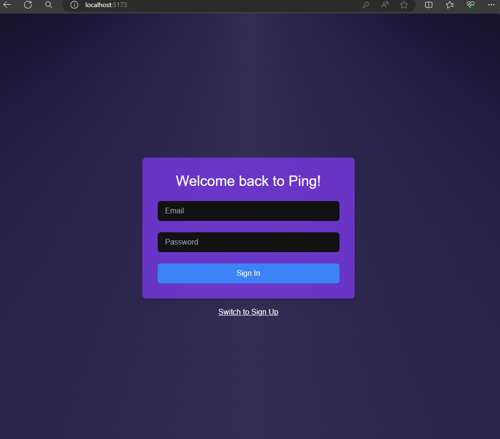
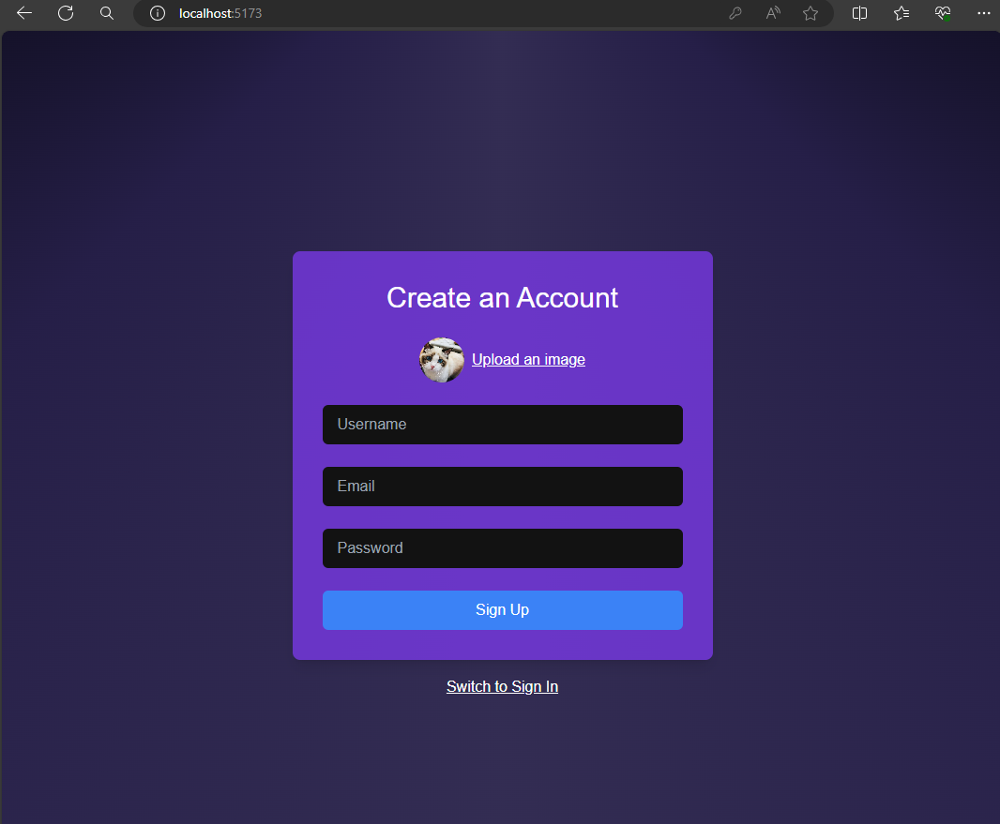
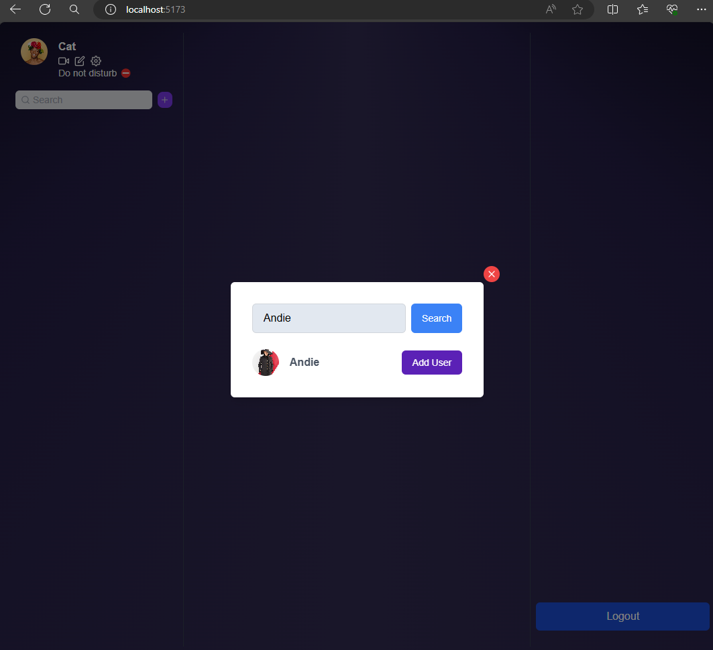

# Ping

Ping is a real-time chat application built using React for the frontend and Firebase for the backend.

## Features

### 1. Real-time messaging:

Instantly send and receive messages with other users.

### 2. User authentication:

Securely log in and register using Firebase Authentication.



### 3. Search Users:

Search for other users to start a chat with.


### 4. Firebase Firestore:

Store chat messages and user data in Firestore for scalability and real-time updates.

## Technologies Used

- Reactjs
- Firebase (Authentication, Database, Storage)
- Tailwind CSS

## Installation

1. Clone the repository:

```bash
git clone https://github.com/rdayupay/ping
```

2. Navigate to the project directory:

```bash
cd chat-application
```

3. Install dependencies:

```bash
npm install
```

4. Set up Firebase:

- Create a Firebase project on the Firebase Console.

- Set up Firebase Authentication, database, and storage.

- Copy your Firebase configuration details.

- Create a .env file in the project root and add your Firebase configuration:

```env
VITE_API_KEY=<your-api-key>
```

5. Start the development server:

```bash
npm run dev
```
